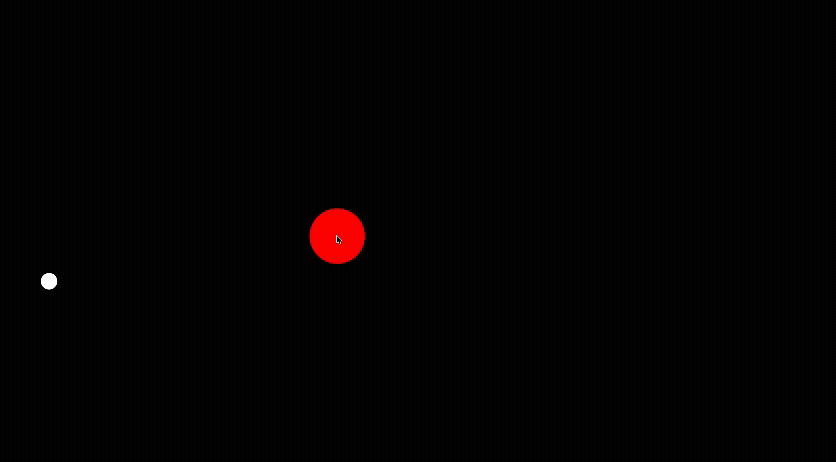

<h1>GRAVITY</h1>
Gravity is a 2d gravity simulation/sandbox made using the p5.js library in Javascript
<h2>(This project was written 4 years ago ago but just recently have I finally uploaded it.)
  [Please note that some of the math and collision detection for the project is off, also some of the code is a bit messy... given it was made some time ago]</h2>

<h2>How to use:</h2>

Press g to create a red "gravitational" object, then pressing t and y will increase and decrease the size of this red object
Once you are satisfied with the size of the object, pressing g again will "place" the object and you can observe it's effects on the white test object.

Pressing l will turn the gravitational object blue, which will instead repel the test object

Pressing f during the creating of an object will fix a size, so the next time you create an object it snaps to that size

Pressing p will pause the test object and fix it in place, you can add as many objects as you want in this time and afterwards you can press p again to unpause

Pressing d will put you in delete mode, so that when you hover over objects you delete them, press d again to get out of delete mode

Pressing r will reset everything to its initial position

Clicking on two points will set the test objects velocity in that direction with that magnitude

